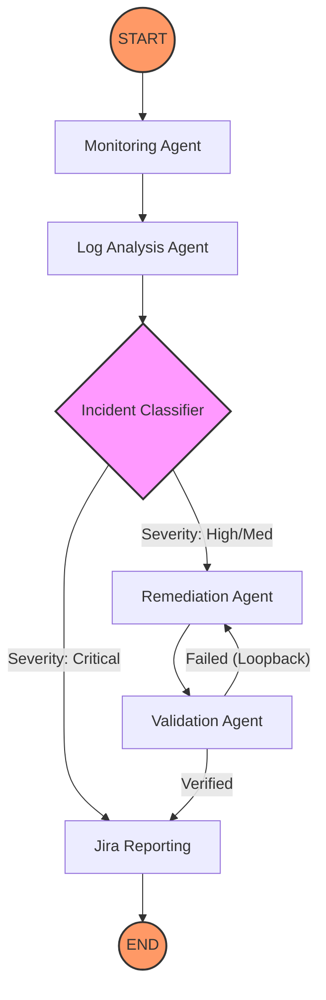

# 🛡️ Enterprise AIOps Platform: Autonomous Incident Remediation

[](https://www.python.org/downloads/)
[](https://github.com/langchain-ai/langgraph)
[](https://fastapi.tiangolo.com/)
[](https://opensource.org/licenses/MIT)

## 📖 Overview

The **Enterprise AIOps Platform** is a production-grade, autonomous incident management system designed to eliminate manual "firefighting" in modern distributed systems. By leveraging a **Multi-Agent architecture powered by LangGraph**, the platform detects system failures, performs deep log analysis, generates remediation plans, validates recoveries, and maintains a full audit trail—all without human intervention.

### 🎯 Business Value
*   **Reduced MTTR (Mean Time To Recovery)**: Automated remediation loops fix common issues in seconds rather than hours.
*   **Zero Alert Fatigue**: Agents filter noise and only escalate high-severity, non-remediable issues (e.g., hardware failure) to on-call engineers.
*   **Immutable Compliance**: Every autonomous decision is recorded in a SOC2-ready audit trail and mirrored to Jira.

---

## ✨ Key Features

*   **🧠 Intelligent Multi-Agent Orchestration**: Decoupled agents for Monitoring, Log Analysis, Classification, Remediation, and Validation.
*   **♻️ Self-Healing Loops**: A cyclic graph topology that allows the system to retry or rollback remediation if initial validation fails.
*   **📊 Live Observability Dashboard**: A Streamlit-based command center for real-time incident tracking and KPI visualization.
*   **🎫 Automated Jira Lifecycle**: Dynamic creation and status mapping of incident tickets based on graph execution results.
*   **🧪 Robust Pipeline Simulator**: Stress-test the system with simulated Database Crashes, OOMKills, and SLO breaches.

---

## 🏗️ Architecture & Flow

### Why LangGraph?
Standard linear scripts fail when faced with non-deterministic system recovery. We chose **LangGraph** because it treats incident response as a **State Machine**. This allows for:
1.  **Cycles**: Retrying remediation if validation fails.
2.  **Persistence**: Maintaining a full "Chain of Thought" across multiple specialized agents.
3.  **Conditional Routing**: Dynamic path selection (e.g., Escalation vs. Remediation) based on high-confidence classification.

### Workflow Visualization


---

## 🚀 Quick Start

### 1. Environment Setup
```bash
# Clone and enter repo
git clone https://github.com/your-org/enterprise-aiops-platform.git
cd enterprise-aiops-platform

# Install dependencies in venv
python -m venv venv
.\venv\Scripts\Activate.ps1   # Windows
pip install -r requirements.txt
cp .env.example .env
```

### 2. Run the Platform
This is a distributed stack. Run these in separate terminals:

**Terminal A: The Agent Engine (FastAPI)**
```bash
uvicorn app.main:app --port 8000
```

**Terminal B: The Ops Dashboard (Streamlit)**
```bash
# Use explicit venv path to avoid global library conflicts
.\venv\Scripts\streamlit.exe run dashboard/streamlit_app.py
```

---

## 🧪 Testing & Quality Assurance

The platform adheres to a **Principal Engineer's "Mission Critical" testing standard**, achieving exhaustive coverage across the entire graph.

*   **Unit Tests**: Isolated logic verification for every Agent node and Pydantic schema.
*   **Integration Tests**: End-to-end "vitality checks" that run the compiled graph against simulated failures.
*   **Command**: `pytest tests/ -v`

---

## 🔮 Demo Scenarios
Navigate to the **⚡ Pipeline Simulator** in the dashboard to trigger:
1.  **Service Crash**: Watch the system detect the failure, classify it as `CRITICAL`, and immediately escalate to human on-call via Jira.
2.  **High Latency**: Watch the agents analyze logs, identify a "Cache Exhaustion" pattern, execute a "Clear Cache" remediation, and validate recovery.

---

## 🛠️ Future Roadmap
1.  **Real Jira API Sync**: Transition from stubbed state to live Atlassian REST API integration.
2.  **Native Observability**: Export platform KPIs (MTTD/MTTR) to Prometheus/Grafana.
3.  **ML Anomaly Detection**: Replace rule-based monitoring with Isolation Forests or Transformer-based log analysis.

---
*Created with ❤️ by the AIOps Engineering Team.*
